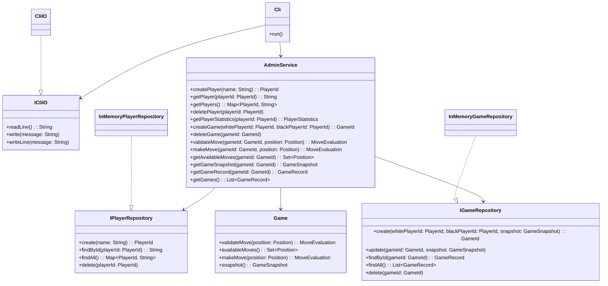

```mermaid
classDiagram

class ICliIO {
    +readLine(): String
    +write(message: String)
    +writeLine(message: String)
}

class IPlayerRepository {
    +create(name: String): PlayerId
    +findById(playerId: PlayerId): String
    +findAll(): Map~PlayerId, String~
    +delete(playerId: PlayerId)
}

class IGameRepository {
    +create(whitePlayerId: PlayerId, blackPlayerId: PlayerId, snapshot: GameSnapshot): GameId
    +update(gameId: GameId, snapshot: GameSnapshot)
    +findById(gameId: GameId): GameRecord
    +findAll(): List~GameRecord~
    +delete(gameId: GameId)
}

class AdminService {
    +createPlayer(name: String): PlayerId
    +getPlayer(playerId: PlayerId): String
    +getPlayers(): Map~PlayerId, String~
    +deletePlayer(playerId: PlayerId)
    +getPlayerStatistics(playerId: PlayerId): PlayerStatistics
    +createGame(whitePlayerId: PlayerId, blackPlayerId: PlayerId): GameId
    +deleteGame(gameId: GameId)
    +validateMove(gameId: GameId, position: Position): MoveEvaluation
    +makeMove(gameId: GameId, position: Position): MoveEvaluation
    +getAvailableMoves(gameId: GameId): Set~Position~
    +getGameSnapshot(gameId: GameId): GameSnapshot
    +getGameRecord(gameId: GameId): GameRecord
    +getGames(): List~GameRecord~
}

class Game {
    +validateMove(position: Position): MoveEvaluation
    +availableMoves(): Set~Position~
    +makeMove(position: Position): MoveEvaluation
    +snapshot(): GameSnapshot
}

class Cli {
    +run()
}

class CliIO {
}

class InMemoryPlayerRepository {
}

class InMemoryGameRepository {
}

Cli --> AdminService
Cli --> ICliIO
CliIO ..|> ICliIO

AdminService --> IPlayerRepository
AdminService --> IGameRepository
AdminService --> Game

InMemoryPlayerRepository ..|> IPlayerRepository
InMemoryGameRepository ..|> IGameRepository
```
