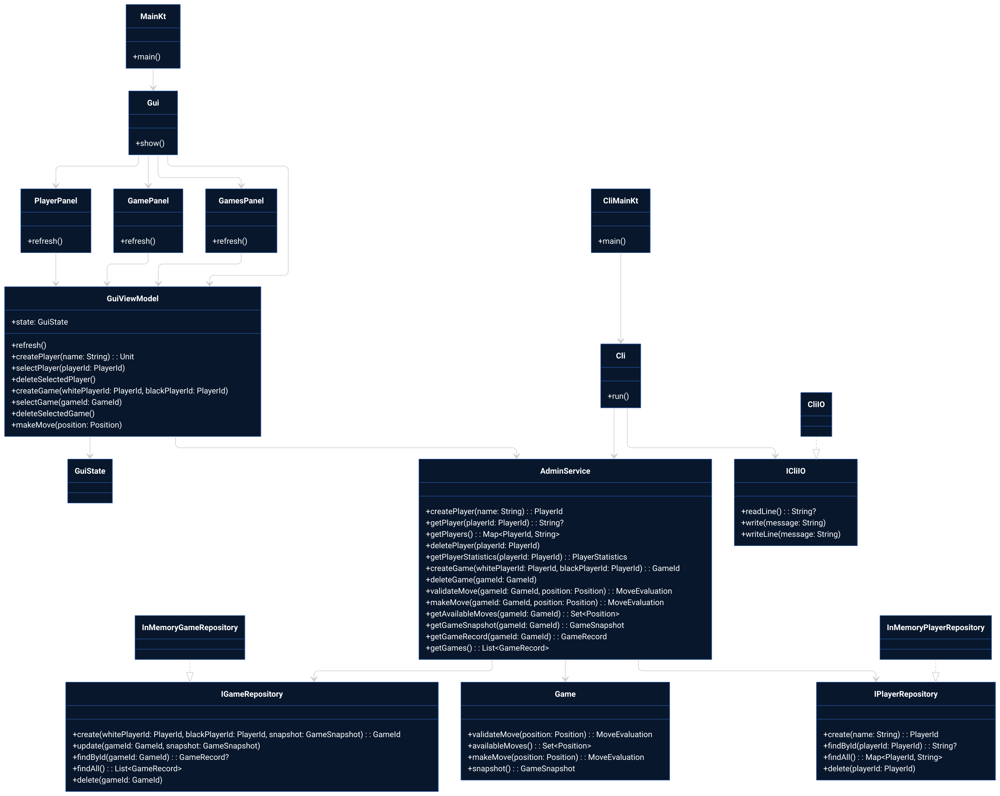
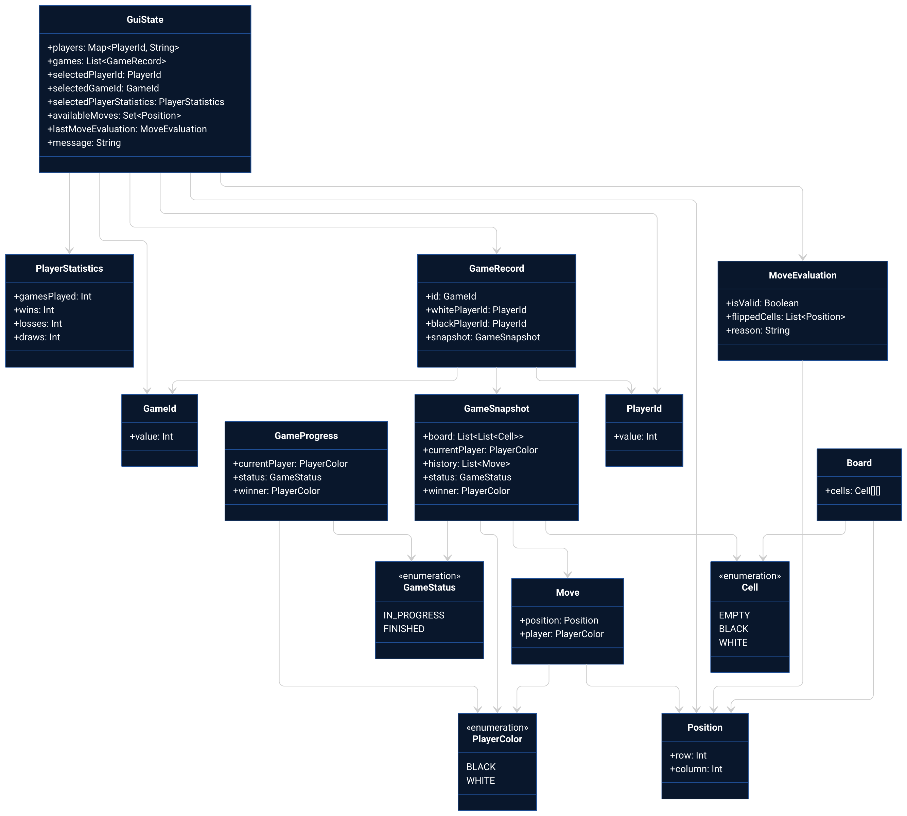

# reversi-admin-panel
CLI and GUI reversi games validator. Written in Kotlin.

## Usage

### Clone
```bash
git clone https://github.com/GidRadium/reversi-admin-panel.git
cd reversi-admin-panel
```

### Build
```bash
./gradlew installDist
```

### Run GUI
```bash
./app/build/install/app/bin/app
```

### Run CLI
```bash
./app/build/install/app/bin/cli
```

### Test
```bash
./gradlew test
```

## Architecture

### Main architecture



[Mermaid source](docs/ARCHITECTURE.md)

### Data model



[Mermaid source](docs/ARCHITECTURE_DATA.md)
