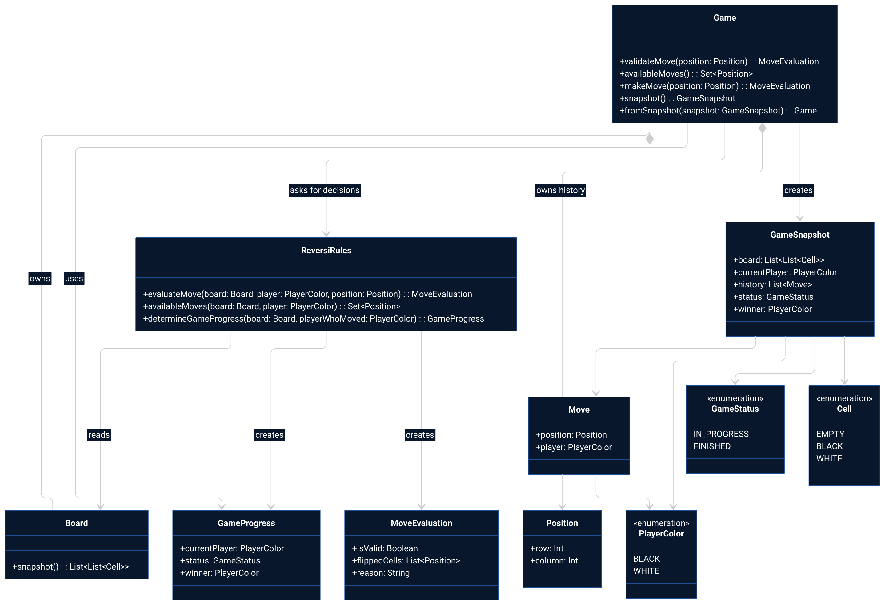
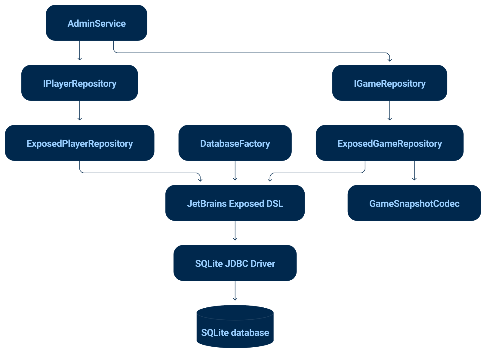

# reversi-admin-panel
CLI and GUI application for managing Reversi games. Written in Kotlin.

## Features

- Player management.
- Reversi game management.
- Game history and player statistics.
- Persistent storage in SQLite.
- CLI and GUI access to the same data.

## Usage

### Clone

```bash
git clone https://github.com/GidRadium/reversi-admin-panel.git
cd reversi-admin-panel
```

### Build

```bash
./gradlew installDist
```

### Run GUI

```bash
./app/build/install/app/bin/app
```

### Run CLI

```bash
./app/build/install/app/bin/cli
```

### Test

```bash
./gradlew test
```

The test suite contains unit, integration, regression and system tests.

### Database

The application uses SQLite for persistent storage.

The database is created automatically on startup and is stored locally in:

```text
data/reversi.db
```

The database stores players, games and game move history.

The CLI and GUI use the same database.

## Architecture

### Main architecture


[Mermaid source](docs/ARCHITECTURE.md)

### Domain model



[Mermaid source](docs/ARCHITECTURE_DOMAIN.md)

### Data model


[Mermaid source](docs/ARCHITECTURE_DATA.md)

### Database model



[Mermaid source](docs/ARCHITECTURE_DATABASE.md)
