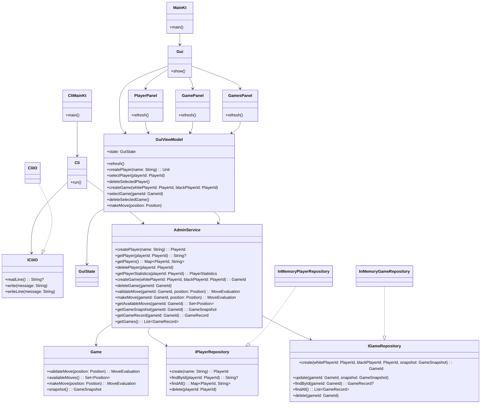

```mermaid
classDiagram

class MainKt {
    +main()
}

class CliMainKt {
    +main()
}

class Cli {
    +run()
}

class ICliIO {
    +readLine(): String?
    +write(message: String)
    +writeLine(message: String)
}

class CliIO {
}

class Gui {
    +show()
}

class PlayerPanel {
    +refresh()
}

class GamePanel {
    +refresh()
}

class GamesPanel {
    +refresh()
}

class GuiViewModel {
    +state: GuiState
    +refresh()
    +createPlayer(name: String): Unit
    +selectPlayer(playerId: PlayerId)
    +deleteSelectedPlayer()
    +createGame(whitePlayerId: PlayerId, blackPlayerId: PlayerId)
    +selectGame(gameId: GameId)
    +deleteSelectedGame()
    +makeMove(position: Position)
}

class GuiState {
}

class AdminService {
    +createPlayer(name: String): PlayerId
    +getPlayer(playerId: PlayerId): String?
    +getPlayers(): Map~PlayerId, String~
    +deletePlayer(playerId: PlayerId)
    +getPlayerStatistics(playerId: PlayerId): PlayerStatistics
    +createGame(whitePlayerId: PlayerId, blackPlayerId: PlayerId): GameId
    +deleteGame(gameId: GameId)
    +validateMove(gameId: GameId, position: Position): MoveEvaluation
    +makeMove(gameId: GameId, position: Position): MoveEvaluation
    +getAvailableMoves(gameId: GameId): Set~Position~
    +getGameSnapshot(gameId: GameId): GameSnapshot
    +getGameRecord(gameId: GameId): GameRecord
    +getGames(): List~GameRecord~
}

class Game {
    +validateMove(position: Position): MoveEvaluation
    +availableMoves(): Set~Position~
    +makeMove(position: Position): MoveEvaluation
    +snapshot(): GameSnapshot
}

class IPlayerRepository {
    +create(name: String): PlayerId
    +findById(playerId: PlayerId): String?
    +findAll(): Map~PlayerId, String~
    +delete(playerId: PlayerId)
}

class IGameRepository {
    +create(whitePlayerId: PlayerId, blackPlayerId: PlayerId, snapshot: GameSnapshot): GameId
    +update(gameId: GameId, snapshot: GameSnapshot)
    +findById(gameId: GameId): GameRecord?
    +findAll(): List~GameRecord~
    +delete(gameId: GameId)
}

class InMemoryPlayerRepository {
}

class InMemoryGameRepository {
}

MainKt --> Gui
CliMainKt --> Cli

Cli --> AdminService
Cli --> ICliIO
CliIO ..|> ICliIO

Gui --> PlayerPanel
Gui --> GamePanel
Gui --> GamesPanel
Gui --> GuiViewModel

PlayerPanel --> GuiViewModel
GamePanel --> GuiViewModel
GamesPanel --> GuiViewModel

GuiViewModel --> GuiState
GuiViewModel --> AdminService

AdminService --> Game
AdminService --> IPlayerRepository
AdminService --> IGameRepository

InMemoryPlayerRepository ..|> IPlayerRepository
InMemoryGameRepository ..|> IGameRepository
```
