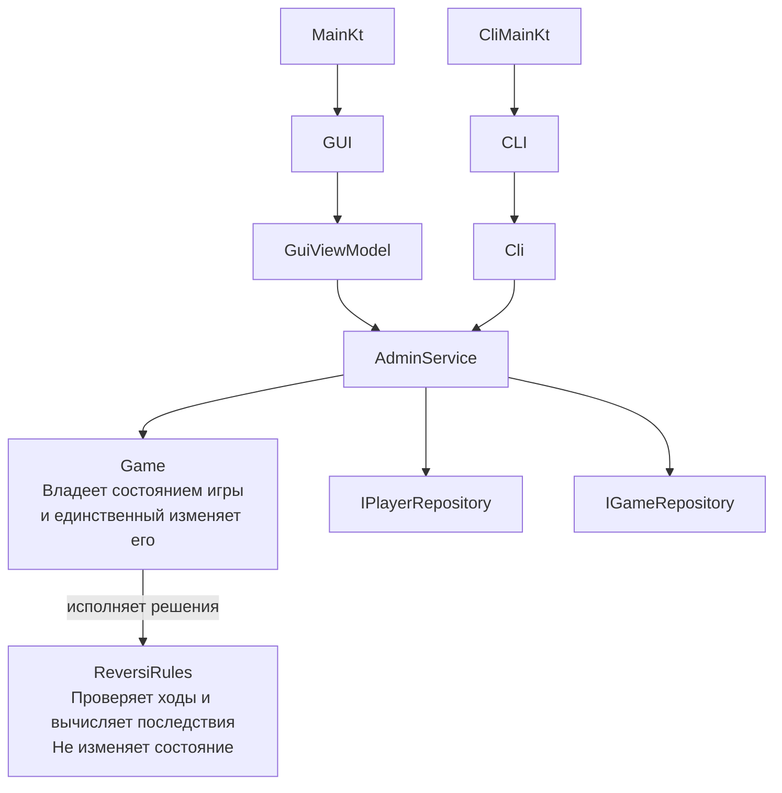

```mermaid
flowchart TD

    Main["MainKt"]
    CliMain["CliMainKt"]

    GUI["GUI"]
    CLI["CLI"]

    ViewModel["GuiViewModel"]
    CliController["Cli"]

    Service["AdminService"]

    Game["Game<br/>Владеет состоянием игры<br/>и единственный изменяет его"]
    Rules["ReversiRules<br/>Проверяет ходы и вычисляет последствия<br/>Не изменяет состояние"]

    PlayerRepository["IPlayerRepository"]
    GameRepository["IGameRepository"]

    Main --> GUI
    CliMain --> CLI

    GUI --> ViewModel
    CLI --> CliController

    ViewModel --> Service
    CliController --> Service

    Service --> Game
    Service --> PlayerRepository
    Service --> GameRepository

    Game -->|исполняет решения| Rules
```
