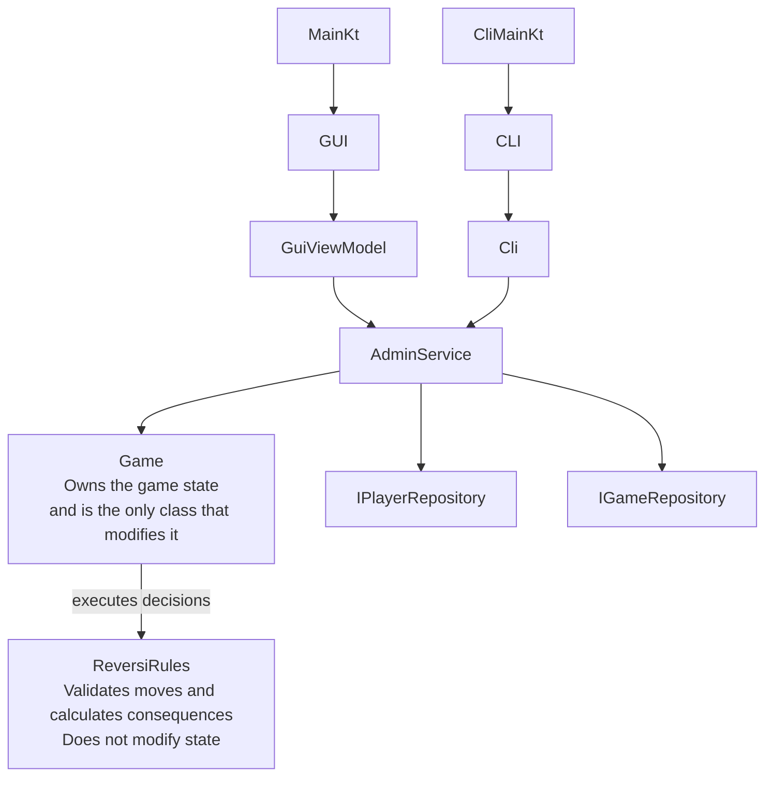

```mermaid
flowchart TD

    Main["MainKt"]
    CliMain["CliMainKt"]

    GUI["GUI"]
    CLI["CLI"]

    ViewModel["GuiViewModel"]
    CliController["Cli"]

    Service["AdminService"]

    Game["Game<br/>Owns the game state<br/>and is the only class that modifies it"]
    Rules["ReversiRules<br/>Validates moves and calculates consequences<br/>Does not modify state"]

    PlayerRepository["IPlayerRepository"]
    GameRepository["IGameRepository"]

    Main --> GUI
    CliMain --> CLI

    GUI --> ViewModel
    CLI --> CliController

    ViewModel --> Service
    CliController --> Service

    Service --> Game
    Service --> PlayerRepository
    Service --> GameRepository

    Game -->|executes decisions| Rules
```
