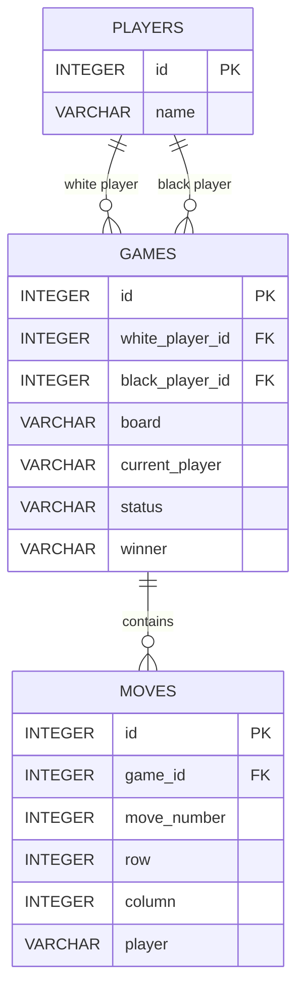

```mermaid
erDiagram

    PLAYERS {
        INTEGER id PK
        VARCHAR name
    }

    GAMES {
        INTEGER id PK
        INTEGER white_player_id FK
        INTEGER black_player_id FK
        VARCHAR board
        VARCHAR current_player
        VARCHAR status
        VARCHAR winner
    }

    MOVES {
        INTEGER id PK
        INTEGER game_id FK
        INTEGER move_number
        INTEGER row
        INTEGER column
        VARCHAR player
    }

    PLAYERS ||--o{ GAMES : "white player"
    PLAYERS ||--o{ GAMES : "black player"
    GAMES ||--o{ MOVES : "contains"
```
