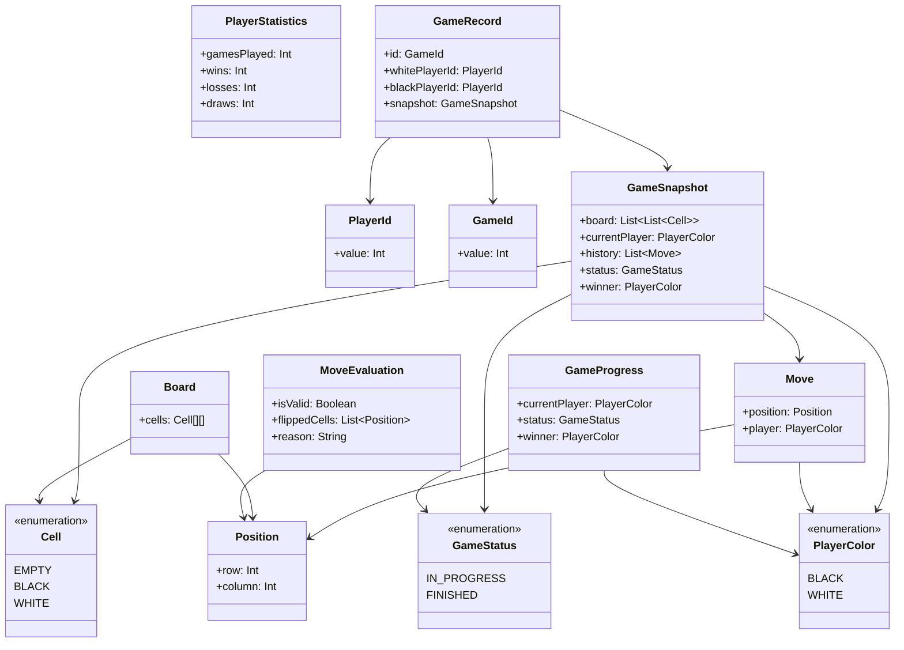

```mermaid
classDiagram

class PlayerId {
    +value: Int
}

class GameId {
    +value: Int
}

class PlayerStatistics {
    +gamesPlayed: Int
    +wins: Int
    +losses: Int
    +draws: Int
}

class GameRecord {
    +id: GameId
    +whitePlayerId: PlayerId
    +blackPlayerId: PlayerId
    +snapshot: GameSnapshot
}

class GameSnapshot {
    +board: List~List~Cell~~
    +currentPlayer: PlayerColor
    +history: List~Move~
    +status: GameStatus
    +winner: PlayerColor
}

class Board {
    +cells: Cell[][]
}

class Position {
    +row: Int
    +column: Int
}

class Move {
    +position: Position
    +player: PlayerColor
}

class MoveEvaluation {
    +isValid: Boolean
    +flippedCells: List~Position~
    +reason: String
}

class GameProgress {
    +currentPlayer: PlayerColor
    +status: GameStatus
    +winner: PlayerColor
}

class Cell {
    <<enumeration>>
    EMPTY
    BLACK
    WHITE
}

class PlayerColor {
    <<enumeration>>
    BLACK
    WHITE
}

class GameStatus {
    <<enumeration>>
    IN_PROGRESS
    FINISHED
}

GameRecord --> GameId
GameRecord --> PlayerId
GameRecord --> GameSnapshot

GameSnapshot --> Cell
GameSnapshot --> PlayerColor
GameSnapshot --> GameStatus
GameSnapshot --> Move

Move --> Position
Move --> PlayerColor

Board --> Cell
Board --> Position

MoveEvaluation --> Position
GameProgress --> PlayerColor
GameProgress --> GameStatus
```
