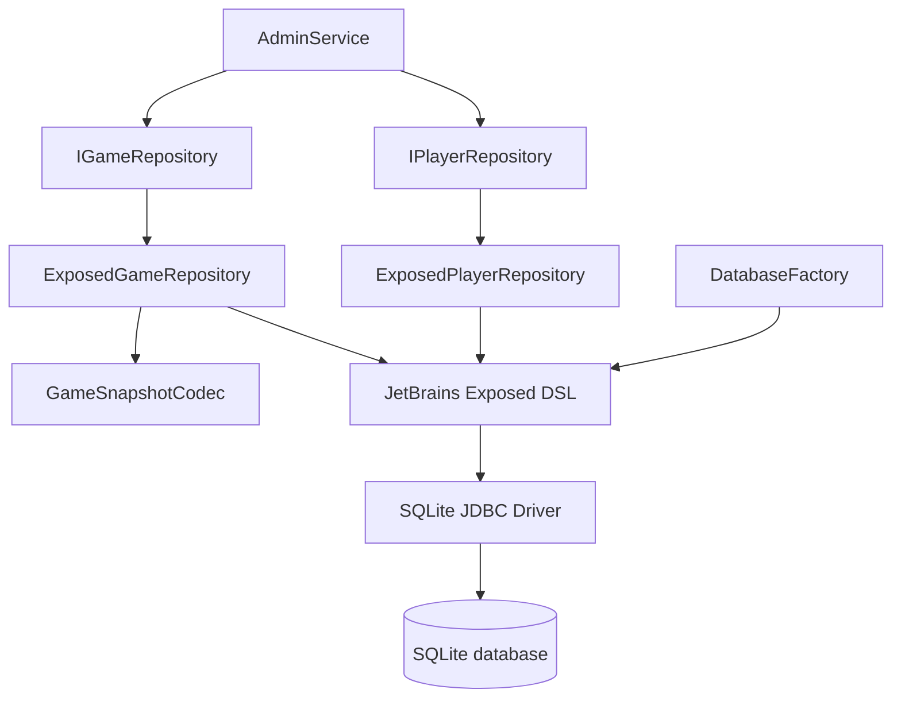

```mermaid
flowchart TD

    Service["AdminService"]

    PlayerInterface["IPlayerRepository"]
    GameInterface["IGameRepository"]

    PlayerRepository["ExposedPlayerRepository"]
    GameRepository["ExposedGameRepository"]

    DatabaseFactory["DatabaseFactory"]
    SnapshotCodec["GameSnapshotCodec"]

    Exposed["JetBrains Exposed DSL"]
    JDBC["SQLite JDBC Driver"]
    SQLite[("SQLite database")]

    Service --> PlayerInterface
    Service --> GameInterface

    PlayerInterface --> PlayerRepository
    GameInterface --> GameRepository

    PlayerRepository --> Exposed
    GameRepository --> Exposed

    GameRepository --> SnapshotCodec

    DatabaseFactory --> Exposed
    Exposed --> JDBC
    JDBC --> SQLite
```
