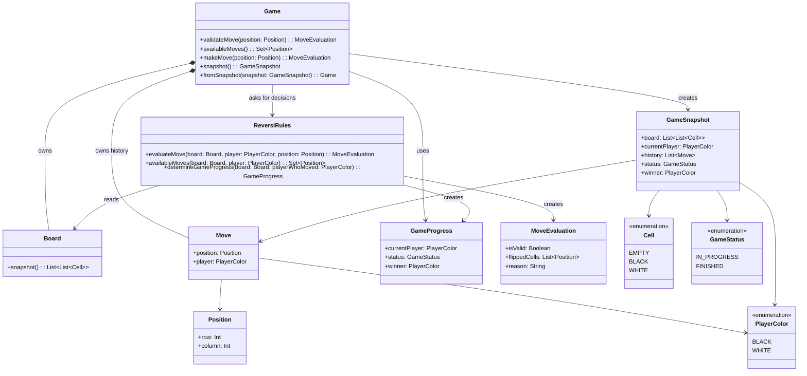

```mermaid
classDiagram

class Game {
    +validateMove(position: Position): MoveEvaluation
    +availableMoves(): Set~Position~
    +makeMove(position: Position): MoveEvaluation
    +snapshot(): GameSnapshot
    +fromSnapshot(snapshot: GameSnapshot): Game
}

class ReversiRules {
    +evaluateMove(board: Board, player: PlayerColor, position: Position): MoveEvaluation
    +availableMoves(board: Board, player: PlayerColor): Set~Position~
    +determineGameProgress(board: Board, playerWhoMoved: PlayerColor): GameProgress
}

class Board {
    +snapshot(): List~List~Cell~~
}

class GameSnapshot {
    +board: List~List~Cell~~
    +currentPlayer: PlayerColor
    +history: List~Move~
    +status: GameStatus
    +winner: PlayerColor
}

class Move {
    +position: Position
    +player: PlayerColor
}

class Position {
    +row: Int
    +column: Int
}

class GameProgress {
    +currentPlayer: PlayerColor
    +status: GameStatus
    +winner: PlayerColor
}

class MoveEvaluation {
    +isValid: Boolean
    +flippedCells: List~Position~
    +reason: String
}

class Cell {
    <<enumeration>>
    EMPTY
    BLACK
    WHITE
}

class PlayerColor {
    <<enumeration>>
    BLACK
    WHITE
}

class GameStatus {
    <<enumeration>>
    IN_PROGRESS
    FINISHED
}

Game *-- Board : owns
Game *-- Move : owns history
Game --> GameProgress : uses
Game --> ReversiRules : asks for decisions

ReversiRules --> Board : reads
ReversiRules --> MoveEvaluation : creates
ReversiRules --> GameProgress : creates

Game --> GameSnapshot : creates
GameSnapshot --> Move
Move --> Position
Move --> PlayerColor
GameSnapshot --> PlayerColor
GameSnapshot --> GameStatus
GameSnapshot --> Cell
```
